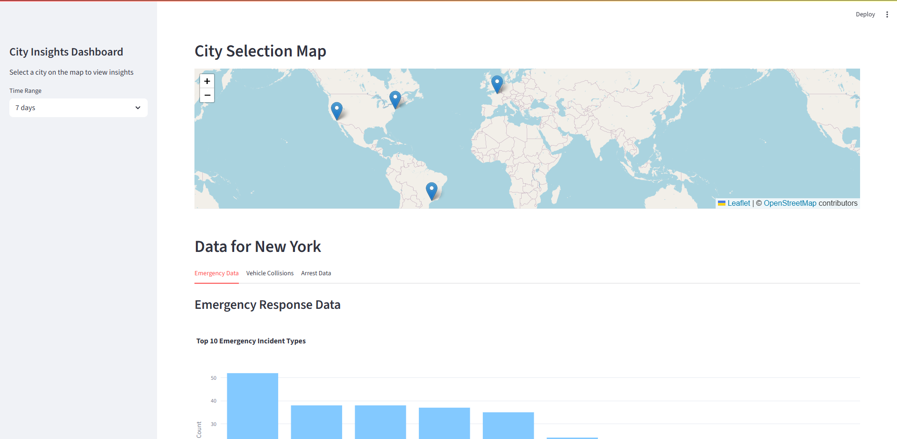

# Open-Data-City-Insights-Dashboard

This repository contains implementations for a city dashboard that organizes and displays data from open APIs. The interface is built using Python and the Streamlit framework, which allows for easy creation of interactive web applications. All data is fetched from various open APIs and saved in Google Cloud Platform's BigQuery service. The dashboard provides a user-friendly interface to visualize this data, making it accessible and understandable for users.




In oder to run the dashboard, you need to have Python installed on your machine (I used 3.12). With Python installed, you can create a virtual environment and install the required packages.

```bash
# Create a virtual environment
python -m venv .venv

# Activate the virtual environment
# On Windows
.venv\Scripts\activate
# On macOS/Linux
source .venv/bin/activate

# Install the required packages
pip install -r requirements.txt
```

For everyting to work, you need to have Google Cloud Platform account and set up a service account. Create `.env` file in the root directory of the project, it should contain the following variables.

```env
GOOGLE_APPLICATION_CREDENTIALS=/path/to/your/credentials.json
```

You can also use the `gcloud` command line tool to set the environment variable and use a user's default application credentials:

```bash
gcloud auth application-default login
```
